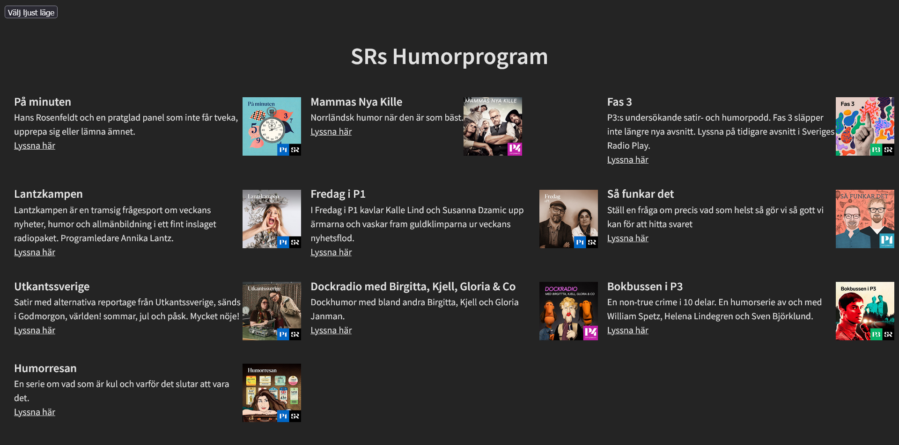
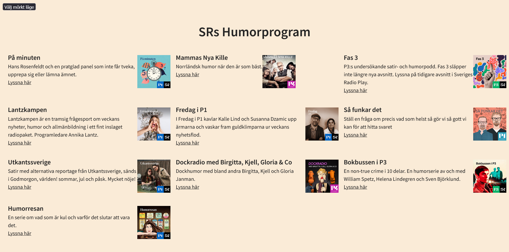
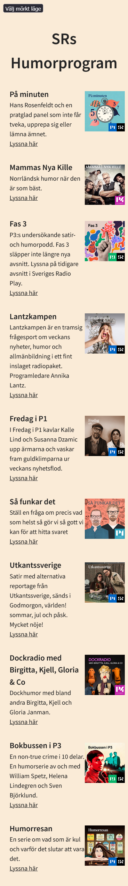

G

- [x ] Få projektet att funka
- [x ] CSS till Sass
- [x ] Enhetlig namngivning i CSS:en
- [x ] Konvertera till TypeScript
- [x ] Enhetlig kodkvalitet
- [x ] Mobilvyn
- [x ] Språk
- [ ] Rensa loggning
- [x ] Dokumentation
- [x ] Tillgänglighet (bilder)
- [ ] Refaktorera funktioner
- [ ] Eliminera onödig kod
- [ ] Rensa bort kod som inte ska sättas

VG

- [ ] Rätt sak på rätt plats
- [ ] Hantera loggning på ett effektivt sätt
- [ ] Gör en tillgänglighetsgranskning av sidan
- [ ] Utnyttja features i Sass i CSS:en
- [ ] Rensa bort paket som inte används
- [ ] Hantera fel i API-anropet
- [ ] Gör en Lighthouse-analys
- [ ] Läs av utvecklingsmiljön
- [ ] Enhetlig syntax i CSS:en
- [ x] Publicera sidan på GitHub pages

Om projekt:

## Titel och beskrivning

"SR Humorprogram" projekt är en sida som presenterar en lista över humor program från Sveriges radio där du kan välja vilket program du vill lyssna på när du väljer att dirigeras direkt till sidan för det programmet.

## Användning

- Sida har två temaalternativ, ett ljus och ett mörkt, som fungerar genom funktionaliteten hos en knapp för att växla mellan dem.

## Teknologier

Projekten är byggt med:


## a11y och skärmdumpar

- Sida är byggd responsive och ser ut så:





## Installation

Installera projekten med npm

```bash
  npm install
```

## Köra tester

Om du vill köra tester kör du följande kommando för Vite

```bash
  npm run dev
```
